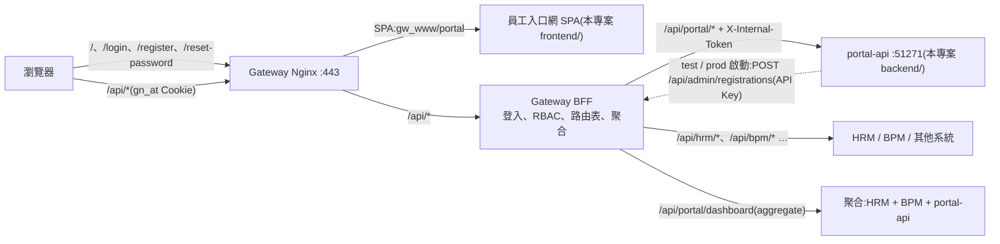
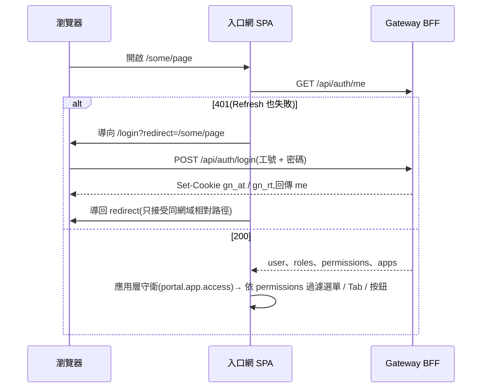
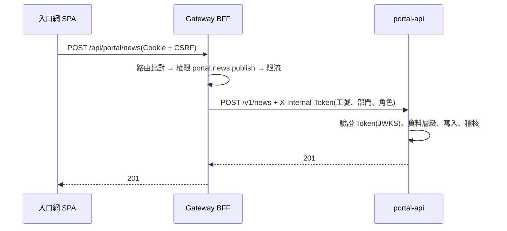
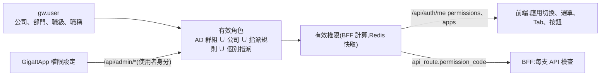

# 員工入口網 — 架構與技術文件

> 對應 [PRD.md](PRD.md) v0.1.2;上位規範為 Gateway PRD v0.7(`../../giga-api-gateway-bff/docs/PRD.md`)。
> **狀態:M1 前端已實作**(§5、§6 已依程式更新),前端已可發佈到本機 Nginx(§9);portal-api(§7)仍為規劃。

---

## 1. 整體架構

| 元件 | 說明 |
| --- | --- |
| 員工入口網 SPA | Vue 3 + Vite,`base: '/'`;登入頁、首頁、各功能頁;發佈到 `gw_www/portal/releases/<sha>`,`current` symlink 原子切換 |
| portal-api | Fastify 5 + TypeScript,Gateway 後端樣本為基礎;只接受 BFF 轉入的請求(`X-Internal-Token`);存入口網自有資料 |
| Gateway BFF | 登入、Session、`/api/auth/me`(`permissions`、`apps`)、權限檢查、路由與聚合;**權限唯一來源** |
| GigaItApp | 設定各應用的選單 / Tab / 按鈕權限(以使用者身分呼叫 BFF 管理 API);應用切換的另一端 |

## 2. 關鍵設計決策

| # | 決策 | 理由 | 取捨 |
| --- | --- | --- | --- |
| A1 | 使用 Gateway 單一入口,本專案不保存帳號 | 一次登入、各應用共用 Cookie(FRONTEND-GUIDE §7.1);登入安全機制集中在 BFF | 依賴 BFF 可用性;BFF 停機時入口網無法登入 |
| A2 | 權限唯一來源為 BFF,按鈕權限 = API 權限 | 畫面與 API 檢查一致,不會出現「看得到按鈕卻 403」 | 每個按鈕都要有權限代碼;需 Gateway 實作 P2-3a |
| A3 | 角色可依部門(含下層)、職級(職稱選配)自動指派 | 人事異動自動生效(PRD G3) | 依賴 BPM 人事與組織資料品質;以權限試算輔助 |
| A4 | portal-api 是一般下游後端(經 BFF),不像 itapp-api 由 Nginx 直通 | 身分由 BFF 以內部 Token 傳遞,權限在 BFF 檢查,與其他系統一致 | 多一層轉發(同機,延遲可忽略) |
| A5 | 出勤、假期、簽核等資料不經 portal-api | 避免入口網變成所有系統的代理;權限與資料責任留在各系統 | 首頁需聚合路由(BFF aggregate)減少請求數 |
| A6 | 框架複製自 GigaItApp 後分離,不共用套件 | 公司尚無 Package Registry;兩者都在早期,需獨立演進 | UI 修正需兩邊同步;Registry 上線後抽成共用套件(PRD Q5) |
| A7 | 風格以 CSS 變數切換(`data-theme` × `data-style`) | 元件不需知道目前風格;切換不重新載入 | 每個新 token 需定義四組值 |

## 3. 請求流程

### 3.1 登入與啟動

- `PASSWORD_CHANGE_REQUIRED`:登入回應只附限定憑證,SPA 顯示設定新密碼畫面(Gateway PRD §8.2.5–§8.2.6)。
- 權限變更:換頁或 5 分鐘內重新取得 `me`;API 權限由 BFF 以 `pv` 立即生效。

### 3.2 一般 API 與 portal-api

### 3.3 應用切換

1. 頂列「應用切換」讀 `me.apps`(BFF 已依 `app` 權限過濾)。
2. 點選其他應用 → 整頁導向 `basePath`(例 `/it/`),Cookie 同網域共用,不需再登入。
3. 目標應用啟動時執行自己的應用層守衛;GigaItApp 沒有 `it.app.access` → `location.replace('/?denied=it')`,入口網顯示「您沒有IT 管理系統的使用權限」後移除參數(參數名稱為本專案提議,需同步到 Gateway FRONTEND-GUIDE §7.4 與 GigaItApp I3)。
4. **暫時做法**:Gateway G3 未實作前 `me` 沒有 `apps`,入口網以 `permissions` 中的 `{system}.app.access` 對照 `composables/apps.ts` 的 `TEMP_APPS` 推導,應用切換下拉底部標示;`me.apps` 出現後自動改用。

## 4. 權限模型

| 層級 | 權限 `kind` | 本專案代碼範例 | 前端用法 |
| --- | --- | --- | --- |
| 應用 | `app` | `portal.app.access` | 應用層守衛 |
| 選單(功能頁) | `menu` | `portal.leave.read` | 路由 `meta.permission`、選單過濾 |
| Tab | `tab` | `portal.leave-history.read` | Tab `permission` |
| 按鈕 | `button` | `portal.leave.apply` | `v-can`;= 對應寫入 API 的權限 |

- 權限代碼在 `portal-api` 的 OpenAPI `x-permissions` 宣告(含 `kind`、`parent`、`sort`),自動註冊寫入 BFF;前端路由與按鈕以同一代碼對應(PRD FR-3.4 由測試檢查)。
- 前端完整權限清單見 PRD §6.5;新增代碼先在 PRD 登記,再改 OpenAPI 與前端。

## 5. 風格(主題)架構

| 維度 | 屬性 | 值 | 預設 |
| --- | --- | --- | --- |
| 明暗 | `<html data-theme>` | `light` / `dark` | 依系統設定 |
| 風格 | `<html data-style>` | `glass` / `flat` | `glass`;不支援 `backdrop-filter` 或 `prefers-reduced-transparency` 時 `flat` |

- `tokens.css` 定義基礎色(綠能色盤)與四組組合的面板、邊框、陰影、模糊、背景 token;元件只讀 token。
- 偏好存瀏覽器(`localStorage` 的 `portal.theme` / `portal.style`,讀寫包 try/catch);之後存 portal-api 個人設定(PRD Q6)。
- 啟動時 `index.html` 先載入 `public/theme-init.js` 套用屬性,避免閃爍;因 Gateway CSP(`default-src 'self'`)不允許 inline script,所以是獨立檔案。

## 6. 前端架構

| 目錄 | 內容 |
| --- | --- |
| `src/ui/` | G* 全域元件(新增 GHero、GAppSwitcher、GStyleToggle、GAlert)、`styles/tokens.css`(綠能 × 玻璃 / 扁平)、圖表色盤;自 GigaItApp 複製 |
| `src/layouts/` | `AppLayout`(側欄兩層選單、頂列:風格 / 明暗、**應用切換**、帳號)、`TabbedPage`、`AuthLayout`(登入 / 註冊 / 忘記密碼 / 維護 / 無權限)、`ChangePasswordModal` |
| `src/pages/` | `auth/`(Login 含首次登入設定密碼、Register 含啟用連結、ResetPassword 含重設連結)、`home/Home`、`Placeholder`(M4 / M5 功能頁)、`NoAccess`、`Unavailable`、`Forbidden`、`NotFound` |
| `src/composables/` | `session`(me 快取、5 分鐘更新)、`apps`(應用切換與守衛)、`menu`(選單過濾)、`redirect`、`theme` / `themeRules`、`usePaged`、`useAsync` |
| `src/api/` | `gateway.ts`(web-kit 包裝:登入、密碼、註冊、`describeError`)、`portal.ts`(規劃,`/api/portal/*`)、顯示格式 |
| `src/router.ts` | 兩層選單(`MENU_GROUPS` + 路由 meta `group`)→ TabbedPage → Tab 子路由;全域守衛如下 |

全域守衛(`router.ts`):

1. `meta.public`(登入、註冊、忘記密碼、維護頁)→ 放行。
2. `ensureMe()`:BFF 無法連線 → `/unavailable`(維護頁,可重試);未登入 → `/login?redirect=`。
3. 應用層:沒有 `portal` 應用 → `/no-access`(無權限頁本身 `meta.noAppGuard`,不會迴圈)。
4. 頁面:路由鏈上任一 `meta.permission`(menu / tab)沒有 → `/403`;首頁沒有權限時改到第一個可見功能。
5. 登入後導回:`safeRedirect()` 只接受同網域相對路徑;不屬於入口網路由的路徑(例 `/it/`)整頁導向。

## 7. 後端架構(規劃,portal-api)

| 目錄 | 內容 |
| --- | --- |
| `src/app.ts`、`server.ts`、`config.ts` | 依後端樣本:SDK `loadGatewayEnv`、內部 Token 驗證、`/healthz` / `/readyz` / `/openapi.json`、啟動時自動註冊 |
| `src/openapi.ts` | `x-gateway`(upstream `portal-api`、system `portal`,project 由 SDK 自 `package.json` 寫入)、`x-permissions`(含前端 menu / tab / button) |
| `src/routes/` | `news`、`resources`、`onboarding`、`links`(schema、權限宣告) |
| `src/store/` | 資料儲存:第一版 JSON 檔(同 GigaItApp);上正式區前改 SQL Server(Gateway DATABASE §0 的 2012 限制) |
| `test/` | OpenAPI 自我檢查(必填欄位、`x-gherkin`、前端權限代碼皆已宣告)、內部 Token、資料層級 |

## 8. 技術棧

| 類別 | 選擇 |
| --- | --- |
| 前端 | Vue 3.5、Vite、vue-router、TypeScript、lucide(經 GIcon)、ECharts(圖表,同 GigaItApp) |
| 後端 | Node.js 22、Fastify 5、`@fastify/swagger`、`@giganexus/backend-sdk`(vendor tgz) |
| Gateway 共用 | `@giganexus/web-kit`(CSRF、Token 自動更新、`useAuth`);尚未發佈,**以 Vite / tsconfig alias 指向 `../giga-api-gateway-bff/web-kit/src`**(同 Gateway sample-spa;可用 `WEB_KIT_DIR` 覆寫),Docker 建置時以 compose `additional_contexts`(`webkit`)帶入並設 `WEB_KIT_DIR`;Registry 上線後改為套件相依 |
| 測試 | Vitest(前端 composables,`frontend/test/`)、`node:test` / Vitest(後端)、瀏覽器操作(四種風格組合、375px) |

## 9. 部署

| 項目 | 內容 |
| --- | --- |
| 前端 | `deploy/docker-compose.yml` 的 `spa-portal`:建置映像 → 發佈到 `gw_www` 的 `portal/releases/<版本>` 並原子切換 `current`(取代 Gateway 範例 `tools/sample-spa/portal`,Nginx 設定不需改);`... run --rm spa-portal rollback portal` 回滾。版本名稱預設為建置時間(`RELEASE_SHA` 可指定),**不可為 `dev`**(Gateway 範例佔用 `releases/dev`)。本機已發佈;公司測試區在 CI 就緒前依 Gateway `docs/TEST-DEPLOY-RUNBOOK.md` 步驟 7 手動發佈(`--env-file`,範本 `deploy/test.env.example`),權限以 `deploy/apply-gateway-rbac.sh` 套用 `deploy/gateway-rbac.yaml`;CI 與正式區(Gateway G6)於 M4 |
| 後端 | `portal-api` 容器加入 Gateway Docker 網路,別名 `portal-api:51271`;API Key 以 Docker secret 掛載;test / prod 自動註冊為草稿,IT 發佈後生效 |
| 本機 | 以 Gateway 本機環境(`../giga-api-gateway-bff/deploy/dev/up.sh`)為基礎;入口網的權限代碼與測試角色以 `sh deploy/apply-gateway-dev-rbac.sh` 套用(Gateway 的 `deploy/dev/` 不納入版控,所以由本 repo 保存);前端 `npm run dev`(5179)經 proxy 呼叫本機 Gateway;模擬的 `portal-svc`(51270)在 portal-api 上線後移除 |

## 10. 安全檢查清單

- [x] 不在瀏覽器儲存 Token、不解析 JWT(web-kit;localStorage 只存明暗、風格、側欄收合)
- [x] `redirect` 只接受同網域相對路徑(`composables/redirect.ts`,含 `//`、`/\`、控制字元)
- [ ] 所有寫入 API 宣告權限,且等於前端按鈕代碼
- [ ] portal-api 只信任 `X-Internal-Token`,不信任請求本文中的工號 / 部門
- [ ] 錯誤回應不含堆疊;日誌不記錄 Cookie、CSRF、密碼
- [ ] 模擬資料在畫面與回應都有標示
