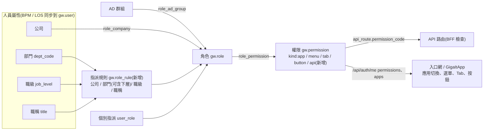
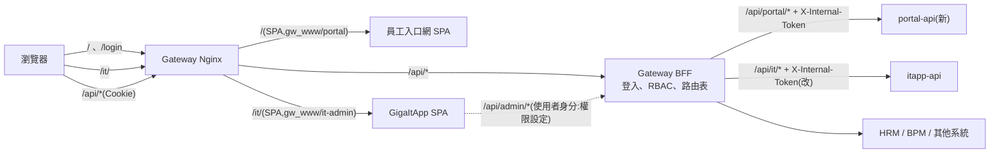

# GigaNexus 員工入口網 — 產品需求文件(PRD)

> 集團員工每天的第一個畫面:登入、個人資訊、待辦與簽核、常用功能、公告與行程;並作為各應用(員工入口網、IT 管理系統…)的**單一入口與應用切換點**。
> 選單、Tab、按鈕依**角色、部門、職位**控管;權限資料以 **Gateway BFF 為唯一來源**,由 IT 管理系統(GigaItApp)設定。
> 本文件以 **BDD** 撰寫:每項需求附驗收場景(`docs/Gherkin/`)。

---

## 1. 文件資訊

| 項目 | 內容 |
| --- | --- |
| 產品名稱 | GigaNexus 員工入口網(giga-Portal) |
| 文件版本 | **v0.1.2(草案)** |
| 建立日期 | 2026-09-26 |
| 技術棧 | 與 GigaItApp 相同,**複製其框架後分離**:Vue 3 + Vite(前端)/ Node.js 22 + Fastify 5 + TypeScript(後端 `portal-api`,以 Gateway 後端樣本 `samples/node-backend` 為基礎) |
| 上位規範 | Gateway PRD **v0.7**(§7.2.1 子路徑、§8.2 登入、§8.3.1 指派規則、§8.3.2 UI 權限分類、§8.3.3 應用登記與切換、§8.7 管理 API)、DATABASE §3.2、FRONTEND-GUIDE v0.2(§7 登入與權限、§7.4 應用切換、§7.5 選單 / Tab / 按鈕)、BACKEND-GUIDE v0.4(§3.3 port 51271、§4 內部 Token、§6.1 `x-permissions`、§7.5 自動註冊);跨專案規則見 Gateway `AGENT.md` §10 |
| 相關文件 | [ARCHITECTURE.md](ARCHITECTURE.md)、[API.md](API.md)、[UI-GUIDE.md](UI-GUIDE.md)、[PROJECT-MAP.md](PROJECT-MAP.md)、[Gherkin/](Gherkin/README.md)、[../AGENT.md](../AGENT.md) |
| 相關專案 | `../giga-api-gateway-bff/`(登入、RBAC、路由)、`../GigaItApp/`(權限設定畫面;本案同時修改,見 §9) |
| 狀態 | 草案:架構與權限模型已定(§1.2);Gateway 規格已改版為 v0.7(尚未實作);**M1 前端框架已完成並發佈到本機 Nginx**(進度見 §11),portal-api 自 M4;待決事項見 §12 |

### 1.1 修訂紀錄

| 版本 | 日期 | 變更內容 |
| --- | --- | --- |
| v0.1.3 | 2026-10-05 | 對齊 old_PortalSolar 後細分權限代碼(§6.5.1):薪資與個資分開、主管專區與 ESH 每頁加上 menu 權限與 `portal-manager` / `portal-esh-admin` 角色;新增待決 Q12–Q15 |
| v0.1.2 | 2026-09-26 | M1 實作狀態:前端框架完成並發佈本機 Nginx(§11 進度);應用切換暫以 app 權限推導(Gateway G3 前);本機權限代碼暫存 `deploy/gateway-dev-rbac.yaml`;GigaItApp 已先加入應用切換(I3 部分);Q9 依 D1 標為已決定 |
| v0.1.1 | 2026-09-26 | Q1(職位以**職級**為主)、Q2(部門**含下層**,部門樹由 BPM 同步)、Q4(`portal-api` 51271)、Q7(Gateway 本機帳號為緊急帳號)定案;Gateway 規格改版 v0.7(G1–G4、G7 已寫入規格);GigaItApp 改用單一入口後以使用者身分直接呼叫 BFF 管理 API,不再需要服務帳號;建立 AGENT.md 與 docs 文件組 |
| v0.1 | 2026-09-26 | 初稿:產品範圍、單一入口與應用切換、Gateway 統一權限模型(角色 / 部門 / 職位 → 應用 / 選單 / Tab / 按鈕)、淺綠科技風格與「玻璃 / 扁平」切換、Gateway 與 GigaItApp 的配合修改 |

### 1.2 已定案的決策(2026-09-26 需求方確認)

| # | 決策 | 影響 |
| --- | --- | --- |
| D1 | 員工入口網使用 **Gateway 單一入口登入**(`/login`,AD / 本機帳號),並負責登入、註冊、忘記密碼頁面 | FRONTEND-GUIDE §7.1:各系統不做登入頁,由入口網提供 |
| D2 | **GigaItApp 改用 Gateway 單一入口**,取消自有帳號與登入頁 | 推翻 GigaItApp PRD v0.1「自有登入」;兩個應用切換不需重新登入(§9.2) |
| D3 | 選單 / Tab / 按鈕 / 應用權限**以 Gateway BFF 為唯一來源**;GigaItApp 提供設定畫面(直接寫入 BFF) | Gateway 需新增依部門 / 職位指派角色、權限分類與管理寫入 API(§9.1) |
| D4 | 按鈕權限 = API 權限:按鈕的權限代碼與其呼叫的 API 路由的 `permission_code` 相同,**BFF 一定再檢查** | 前端隱藏只是體驗(FRONTEND-GUIDE §7.2) |

---

## 2. 產品概述

| 項目 | 內容 |
| --- | --- |
| 使用者 | 集團所有員工(碩禾、禾迅等子公司;AD 與本機帳號) |
| 子路徑 | `/`(Gateway PRD §7.2.1 已保留給員工入口網);Nginx `/` 只由本專案發佈 |
| 前端呼叫 | 一律同網域 `/api/*` 經 BFF(使用者 Cookie);入口網自有 API 為 `/api/portal/*`(`portal-api` 經 BFF 轉入) |
| 登入 | Gateway `/api/auth/*`;入口網提供 `/login`、`/register`、`/reset-password` 畫面 |
| 應用切換 | 右上角帳號旁的「應用切換」,只列出使用者有權限的應用(員工入口網、IT 管理系統,之後的 MES、HRM…) |
| 風格 | 淺綠 / 科技綠(綠能產業:太陽能、儲能);**使用者可切換「玻璃」或「扁平」**,並可切換明亮 / 黑暗 |

---

## 3. 背景與問題

1. 舊單一入口(PortalSolar)功能分散、樣式老舊,且與新系統(Gateway、GigaItApp)登入不共用;Gateway PRD 已規劃新入口網作為單一入口,但目前只有範例頁面。
2. 各應用的選單與按鈕權限各自實作(GigaItApp 自有「職級 × 部門」),IT 無法在一處管理「誰看得到哪個應用、哪個選單、哪個按鈕」。
3. 權限需要依**部門與職位**自動生效(人事異動後不必逐人調整);Gateway 目前只能依 AD 群組、公司或個別指派取得角色。
4. 使用者在 IT 管理系統與入口網之間需要重新登入、各自找網址。

---

## 4. 目標與成功指標

| # | 目標 | 衡量方式 |
| --- | --- | --- |
| G1 | 單一入口 | 登入一次即可使用入口網與 IT 管理系統,切換不需再登入(`auth/app-switch.feature`) |
| G2 | 權限集中 | 應用 / 選單 / Tab / 按鈕權限只在 GigaItApp 設定、只存在 BFF;兩個應用的顯示與 API 檢查結果一致 |
| G3 | 依組織自動生效 | 員工部門或職位異動後,下一次權限計算(人事同步後)即套用新權限,不需人工調整 |
| G4 | 首頁一眼掌握 | 首頁顯示今日出勤、待簽核、假期、公告、行程;首屏 API ≤ 2 次(聚合路由) |
| G5 | 風格一致可切換 | 玻璃 / 扁平 × 明亮 / 黑暗 四種組合皆通過對比檢查,切換不重新載入頁面 |

---

## 5. 使用者與權限模型

### 5.1 使用者角色(舉例)

| 使用者 | 典型需求 |
| --- | --- |
| 一般員工 | 查個人資料、出勤與假期、請假 / 加班申請、公告、分機、常用系統連結 |
| 主管 | 以上 + 待我簽核(核准 / 退回)、部門出勤概況 |
| 人資 / 行政 | 以上 + 發布公告、維護行政資源、新人導覽內容 |
| IT 人員 | 以上 + 應用切換到 IT 管理系統,設定各應用權限 |

### 5.2 權限模型(Gateway BFF 統一)

- **角色來源**:沿用 AD 群組、公司、個別指派,**新增「指派規則」**(Gateway PRD §8.3.1):依公司、部門、職級、職稱比對 `gw.user` 的人事欄位;同一規則內條件為 AND,多條規則為 OR(Q3)。
- **部門**:規則預設**含下層部門**(Q2 已決定),部門樹 `gw.department` 由人員同步自 BPM 組織取得。
- **「職位」**:以**職級**(`job_level`)為主、**職稱**(`title`)為選配條件(Q1 已決定);職級以清單列出,是否支援範圍見 Gateway Q29。
- **權限分類**(`gw.permission.kind`,新增):

| kind | 意義 | 代碼範例 | 前端 | BFF |
| --- | --- | --- | --- | --- |
| `app` | 可使用某應用 | `portal.app.access`、`it.app.access` | 應用切換清單、應用層路由守衛 | 該應用自有 API 一併檢查 |
| `menu` | 可見某選單功能(頁面) | `portal.leave.read` | 兩層選單、頁面路由守衛 | 該頁讀取 API 使用同一代碼 |
| `tab` | 可見頁內某 Tab | `portal.leave-history.read` | Tab 顯示 | 該 Tab 讀取 API 使用同一代碼 |
| `button` | 可按某按鈕 | `portal.leave.apply`、`bpm.approval.approve` | `v-can` 隱藏 | **對應寫入 API 的 `permission_code`**(D4) |
| `api` | 純 API(系統對系統等,不顯示於 UI) | `gw.admin.route.read` | — | 檢查 |

- 權限代碼格式沿用 `{system}.{resource}.{action}`;`menu` / `tab` / `button` 另記 `parent_code`(掛在哪個應用 / 選單 / Tab 下)與 `sort`,讓 GigaItApp 能以**樹狀**(應用 → 選單 → Tab → 按鈕)設定。
- **定義來源**:每個應用在自己的 OpenAPI 根層 `x-permissions` 宣告權限時,加上 `kind`、`parent`、`sort`,由 SDK 自動註冊寫入 BFF(BACKEND-GUIDE §6.1 擴充);選單的圖示、路徑、中文名稱仍在各應用前端程式(路由 meta),以權限代碼對應。
- 預設:所有登入者有角色 `employee`,`employee` 預設擁有 `portal.app.access` 與首頁、個人資料等基本選單(由 IT 在 GigaItApp 調整)。

---

## 6. 功能需求

### 6.1 登入與 Session(Gateway 單一入口)

| 編號 | 需求 | 驗收場景(規劃) |
| --- | --- | --- |
| FR-1.1 | 入口網提供 `/login`:工號 / AD 帳號 + 密碼,呼叫 `POST /api/auth/login`;錯誤依 Gateway 錯誤代碼顯示(PRD §8.1.1:`INVALID_CREDENTIALS`、`ACCOUNT_NOT_REGISTERED` 引導註冊…) | `auth/login.feature` |
| FR-1.2 | 登入後導回 `redirect` 參數(只接受同網域相對路徑,防止開放重新導向);預設 `/` | `auth/login.feature`:登入後導回原頁、拒絕外部網址 |
| FR-1.3 | `PASSWORD_CHANGE_REQUIRED`(舊單一入口帳號首次登入、IT 重設後)→ 設定新密碼畫面;明示「新入口網密碼與舊單一入口無關」(Gateway PRD §8.2.6) | `auth/password.feature` |
| FR-1.4 | `/register`(無網域子公司自行註冊)、`/reset-password`(Email 連結);流程依 Gateway PRD §8.2.5、Q23 | `auth/register.feature`、`auth/password.feature` |
| FR-1.5 | Session 由 Gateway 管理(`gn_at` / `gn_rt` Cookie);前端以 Gateway web-kit 處理 CSRF 與 Token 自動更新,Refresh 失敗導向 `/login?redirect=` | `auth/session.feature` |
| FR-1.6 | 登出呼叫 `POST /api/auth/logout` 後導向 `/login`;所有應用同時登出 | `auth/session.feature` |

### 6.2 應用切換與路由守衛

| 編號 | 需求 | 驗收場景(規劃) |
| --- | --- | --- |
| FR-2.1 | `GET /api/auth/me` 新增 `apps`:`[{ code, name, basePath, icon }]`,只含使用者有 `kind=app` 權限的應用,依 `sort` 排序(Gateway 新增,§9.1 G3) | `auth/app-switch.feature`:只列出有權限的應用 |
| FR-2.2 | 右上角帳號旁顯示「應用切換」(圖示按鈕 + 下拉):列出 `apps`,標示目前所在應用,點選即以整頁導向該應用 `basePath`;只有一個應用時不顯示 | 同上 |
| FR-2.3 | **GigaItApp 同樣提供應用切換**(共用同一份規格與外觀,§9.2) | 同上 |
| FR-2.4 | 應用層守衛:入口網沒有 `portal.app.access` → 顯示「沒有員工入口網使用權限」頁(含登出);不可導回自己造成迴圈 | `auth/app-guard.feature` |
| FR-2.5 | **GigaItApp 路由守衛**:未登入 → `/login?redirect=/it/…`;已登入但沒有 `it.app.access` → 導回入口網 `/` 並提示「您沒有 IT 管理系統的使用權限」;`/it/api/*`(經 BFF)同樣檢查,回 403 | `auth/app-guard.feature`:沒有 IT 應用權限時導回入口網 |
| FR-2.6 | 頁面守衛:路由 `meta.permission`(menu / tab)無權限 → 403 頁(不是導回首頁,避免使用者以為連結失效) | `ui/navigation.feature` |

### 6.3 權限呈現(選單、Tab、按鈕)

| 編號 | 需求 | 驗收場景(規劃) |
| --- | --- | --- |
| FR-3.1 | 選單兩層(群組 → 功能),功能頁內以 Tab 切換第三層、Tab 對應網址;只顯示有權限的功能,沒有任何可見功能的群組不顯示 | `ui/navigation.feature`:選單依權限過濾 |
| FR-3.2 | 按鈕以 `v-can="'權限代碼'"` 控制;沒有權限時**隱藏**(不是停用),例外情況以 `v-can.disable` 顯示為停用並附說明 | `rbac/button.feature` |
| FR-3.3 | 權限變更(GigaItApp 儲存)後,使用者下一次呼叫 `/api/auth/me`(換頁或 5 分鐘內)即更新選單;BFF 以 `pv` 讓 API 權限立即生效 | `rbac/button.feature`:調整後重新整理即生效 |
| FR-3.4 | 顯示與檢查一致:前端的選單、Tab、按鈕權限代碼必須與 BFF 註冊的權限一致;`portal-api` 啟動測試檢查前端路由 meta 使用的代碼都已宣告於 `x-permissions` | 程式審查、`portal-api` 測試 |

### 6.4 首頁(依參考畫面)

| 編號 | 需求 | 資料來源(第一階段) | 驗收場景(規劃) |
| --- | --- | --- | --- |
| FR-4.1 | 問候橫幅:日期(含星期)、依時段問候「早安 / 午安 / 晚安,姓名」、工號 · 部門 · 職稱 · 分機;快捷按鈕(請假申請、線上打卡、我的待辦,依權限顯示) | `/api/auth/me`、HRM 個人資料 | `home/home.feature` |
| FR-4.2 | 今日出勤卡:上 / 下班打卡時間、打卡狀態標籤;特休剩餘、待我簽核、未讀公告數 | HRM、BPM、公告 | 同上 |
| FR-4.3 | KPI 卡 ×4:本月出勤天數、本月加班時數、待簽核案件、教育訓練時數;含較上月變化 | HRM / BPM(模擬) | 同上 |
| FR-4.4 | 常用功能:圖示格(請假、加班、薪資查詢、表單下載、分機查詢、統編查詢、集團系統、3691 開講),依權限顯示;使用者可自訂排序(v0.2) | 前端設定 + 權限 | 同上 |
| FR-4.5 | 待我簽核:類別標籤、申請事由與單號、申請人、金額 / 時數;「核准」「退回」按鈕(`bpm.approval.approve` / `reject`)需確認,「全部」連到簽核頁 | BPM `/api/bpm/approvals` | `home/approval.feature` |
| FR-4.6 | 我的假期:特休已休 / 剩餘環形圖、補休與病假進度條 | HRM | `home/home.feature` |
| FR-4.7 | 最新公告(未讀數、分類、發布單位與日期)、近期行程(時間、地點) | `portal-api` 公告、行事曆 | 同上 |
| FR-4.8 | 首頁以**聚合路由** `GET /api/portal/dashboard` 一次取得(Gateway 已有範例,§8.4);非必要區塊失敗時該區塊顯示「暫時無法取得」,其他區塊照常 | BFF aggregate | `home/home.feature`:部分區塊失敗 |
| FR-4.9 | 模擬資料必須標示(區塊角落「模擬」標籤),直到對應系統提供真實 API | — | 同上 |

### 6.5 選單功能(第一版範圍)

兩層選單(群組 → 功能 → Tab);權限代碼為暫定,實作前向 IT 登記(FRONTEND-GUIDE §7.2):

| 群組 | 功能(menu) | Tab(tab) | 主要按鈕(button) |
| --- | --- | --- | --- |
| 首頁 | 首頁 `portal.home.read` | — | — |
| 個人服務 | 個人資料 `portal.profile.read` | 基本資料、職務、緊急聯絡人 | 編輯緊急聯絡人 `portal.profile.edit` |
| | 我的假期 `portal.leave.read` | 假期餘額、請假紀錄 | 請假申請 `portal.leave.apply` |
| | 出勤紀錄 `portal.attendance.read` | 本月、歷史 | 線上打卡 `portal.attendance.punch` |
| 表單與簽核 | 待我簽核 `bpm.approval.read` | 待簽核、已簽核、我送出的 | 核准 `bpm.approval.approve`、退回 `bpm.approval.reject` |
| | 表單下載 `portal.form.read` | 依分類 | — |
| 行政資源 | 行政資源 `portal.resource.read` | — | 維護 `portal.resource.edit` |
| | 新人導覽 `portal.onboarding.read` | — | 維護 `portal.onboarding.edit` |
| | 分機表、聯絡窗口 `portal.directory.read` | 分機表、聯絡窗口 | — |
| | 集團統編資訊 `portal.gui-number.read` | — | — |
| 集團與公告 | 公告 `portal.news.read` | 全部、未讀 | 發布公告 `portal.news.publish` |
| | 行事曆 `portal.calendar.read` | 月、清單 | — |
| | 集團系統(外部連結)`portal.links.read`、3691 全民開講 `portal.talk.read` | — | — |

- 參考畫面左下的「設計系統(Canvas UI Kit)」為元件展示頁,只在 dev 與具 `portal.uikit.read` 權限時顯示(Q10)。

#### 6.5.1 對齊舊單一入口後的權限代碼(v0.1.3)

前端已依 `old_PortalSolar` 擴充為 7 個群組;每個功能頁都必須有 menu 權限(**主管專區、ESH 不可無權限開放**,避免舊系統「只隱藏選單、後端不設防」的問題)。代碼登記於 `deploy/gateway-rbac.yaml`,portal-api 上線後改由 `x-permissions` 宣告:

| 群組 | 功能 | menu 權限 | 預設角色 |
| --- | --- | --- | --- |
| 個人資訊 | 個人基本資料 | `portal.profile.read` | employee |
| | 自助查詢 | `portal.attendance.read` | employee |
| | 薪資獎金、年度所得、薪資異動、薪資金鑰重置 | `portal.salary.read`(與個資分開授權;二次驗證待決 Q12) | employee |
| | 出勤異常、出勤時數異常回報 | `portal.attendance-abnormal.read` | employee |
| | BPM 簽核資訊 | `bpm.approval.read` | portal-approver |
| | 郵件審核資訊 / 個人資產明細 / 年度必上課程 / 個人提醒 | `portal.release-mail.read` / `portal.asset.read` / `portal.course.read` / `portal.note.read` | employee |
| 行政資源 | 問卷調查 | `portal.survey.read` | employee |
| 主管專區 | 11 頁,每頁一碼 `portal.mgr.{rights,shift,boss-trace,attendance,leave-balance,promotion,training,safety-course,property,budget,budget-apply}.read` | 見左 | **portal-manager**(Gateway 指派規則依職級,G1);資料由後端依部門(含下層)過濾 |
| ESH | 證照管理 / 項目 / 需求 / 人員 / 管理員 | `portal.esh.{license,item,need,personal,manager}.read` | **portal-esh-admin** |
| | 危害性化學品清單 | `portal.esh.chemical.read` | employee |

其餘頁面沿用上表(§6.5)代碼。

### 6.6 網頁框架與 UI(風格)

| 編號 | 需求 | 驗收場景(規劃) |
| --- | --- | --- |
| FR-6.1 | 版面沿用 GigaItApp:左側兩層選單(可收合,收合時滑鼠移上浮出功能清單)、頂列(頁面標題與麵包屑、全域搜尋、風格切換、明暗切換、通知、**應用切換**、帳號選單)、內容區 | `ui/navigation.feature` |
| FR-6.2 | **主色**:科技綠(綠能),輔色太陽能琥珀、儲能青綠;明亮 / 黑暗兩組 token(§7) | `ui/theme.feature` |
| FR-6.3 | **風格切換**:「玻璃」(半透明毛玻璃、漸層光暈,同參考畫面)與「扁平」(實色面板、無模糊與光暈、1px 邊框、陰影極少);以 `data-style="glass|flat"` 切換 token,元件不各自判斷 | `ui/theme.feature`:切換玻璃 / 扁平 |
| FR-6.4 | 風格與明暗為**個人偏好**:記在瀏覽器(第一版,Q6);未設定時依系統明暗、預設玻璃;不支援 `backdrop-filter` 或使用者開啟「減少透明度」時自動用扁平 | `ui/theme.feature` |
| FR-6.5 | UI 全域元件:自 GigaItApp `src/ui/` 複製(`G*` 元件、tokens、圖表色盤),頁面不自刻樣式;新增「扁平」token 組 | 程式審查 |
| FR-6.6 | 響應式:≤ 960px 選單改抽屜;375px 無整頁水平捲動;首頁卡片由 4 欄降為 2 / 1 欄 | `ui/navigation.feature`:手機寬度 |
| FR-6.7 | 懶加載:頁面依路由分割;Tab 切換才載入;清單後端分頁;首屏以外區塊捲動到才載入(同 GigaItApp FR-6.7) | 各 feature |
| FR-6.8 | 全域搜尋(功能、表單、同仁):第一版只搜尋「有權限的功能」;表單與同仁待資料來源(Q8) | `ui/search.feature` |
| FR-6.9 | 錯誤訊息顯示 BFF `message` 與 `requestId` 前 12 碼 | 程式審查 |

### 6.7 `portal-api`(入口網自有後端)

| 編號 | 需求 |
| --- | --- |
| FR-7.1 | 以 Gateway 後端樣本建立(`@giganexus/backend-sdk`):驗證 `X-Internal-Token`、錯誤格式 `{ code, message, requestId }`(代碼 `PORTAL_` 開頭)、`GW_ENV` 三區 |
| FR-7.2 | **開發專案** `package.json` `gateway.project = "giga-Portal"`;test / prod 啟動時自動註冊 OpenAPI(含 `description`、`x-gherkin`、`x-permissions` 的 `kind` / `parent`)為 Gateway 草稿 |
| FR-7.3 | 第一版 API:公告(清單、未讀、發布)、行政資源 / 新人導覽內容、常用功能與外部連結設定;其餘資料(出勤、假期、簽核、個人資料)**不經 portal-api**,直接呼叫各系統經 BFF 的 API |
| FR-7.4 | 寫入 API 一律宣告權限(= 按鈕權限代碼);資料層級依內部 Token 的 `dept`、`roles` 過濾 |

---

## 7. UI 風格規格(草案)

| Token | 明亮 | 黑暗 | 說明 |
| --- | --- | --- | --- |
| `--c-primary` | `#12a150`(科技綠) | `#2fd67a` | 主色:按鈕、選中、連結 |
| `--c-primary-deep` | `#0b6b3a` | `#0e3b26` | 問候橫幅漸層深色端(參考畫面) |
| `--c-accent-solar` | `#f5a524`(太陽能琥珀) | `#ffc04d` | 強調、提醒、打卡狀態 |
| `--c-accent-storage` | `#12b5a6`(儲能青綠) | `#3ee0cf` | 圖表第二色、資訊標籤 |
| `--bg` | `#f3faf6` + 淡綠漸層網格 | `#08130e` + 綠色微光 | 頁面底色 |
| `--text` / `--text-2` | `#0f2a1d` / `#4b6358` | `#e3f2ea` / `#9fb8ac` | 文字 |

| 項目 | 玻璃(`glass`) | 扁平(`flat`) |
| --- | --- | --- |
| 面板 | 半透明白 / 深綠 + `backdrop-filter: blur(16px)`、內高光邊 | 實色 `--surface`,無模糊 |
| 邊框 | 漸層細邊 | 1px `--line` |
| 陰影 / 光暈 | 柔和陰影 + 綠色光暈 | 無光暈,只保留浮層(下拉、對話框)陰影 |
| 背景 | 漸層網格 + 光點 | 純色 + 極淡網格 |
| 圓角 | 16px | 12px |

- 對比:文字與背景至少 WCAG AA(4.5:1),四種組合都要檢查;圖表色取 `ui/charts/palette.ts`(綠能色盤另行定義)。
- 圖示:沿用 `lucide`(經 `GIcon` 登記);品牌圖示為綠色太陽能 / 能源意象。

---

## 8. 架構

| 項目 | 內容 |
| --- | --- |
| 目錄(複製 GigaItApp) | `frontend/`(Vue)、`backend/`(portal-api)、`deploy/`(compose:`portal-api`、`spa-portal` 發佈到 `gw_www` 的 `portal`)、`docs/`(PRD、ARCHITECTURE、API、UI-GUIDE、Gherkin、PROJECT-MAP、DevelopmentProcess) |
| Port / 服務代碼(待登記,Q4) | `portal-api` **51271**,系統代碼 `portal`(51270 目前為本機模擬 `portal-svc`) |
| 前端呼叫 | 一律 `/api/*`,經 Gateway web-kit(CSRF、Token 自動更新、`useAuth().can()`) |
| 部署 | `spa-portal`:建置 → 發佈到 `gw_www/portal/releases/<sha>`,symlink 原子切換,可回滾;`portal-api`:Docker Compose 加入 Gateway 網路 |
| 設計原則 | 依 Gateway `AGENT.md` §10.7.2 的 TypeScript / Vue 列;專案地圖 `docs/PROJECT-MAP.md` |

---

## 9. 配合修改(其他 repo)

依 Gateway `AGENT.md` §10.3:介面變更**先改 Gateway 規格**,再改實作;各 repo 各自留紀錄與 commit。

### 9.1 Gateway(giga-api-gateway-bff)

| # | 項目 | 說明 |
| --- | --- | --- |
| G1 | 角色指派規則 `gw.role_rule` | 條件:公司、部門(`include_children`)、職級、職稱;權限計算(`computeAuthz`)加入規則比對;人事同步使屬性變更時遞增該使用者 `perm_version` |
| G2 | 權限分類 | `gw.permission` 新增 `kind`、`parent_code`、`sort`;OpenAPI `x-permissions` 擴充同名欄位,匯入 / 自動註冊寫入 |
| G3 | 應用登記與 `/api/auth/me` | `gw.app`(code、name、base_path、icon、sort、permission_code)由 CLI `apply` 維護;`/api/auth/me` 回傳 `apps`(過濾後)與 `menus`(已有欄位,改為權限樹) |
| G4 | 管理寫入 API(PRD §8.7 / P2-3a) | 角色權限、角色指派規則的寫入 API、部門樹、權限試算(稽核、遞增 `pv`);GigaItApp 前端**以使用者身分**直接呼叫,需 `gw.admin.rbac.write` |
| G5 | `/it/api` 改經 BFF | 登記 `itapp-api` 上游、系統代碼 `it`、對外 `/api/it/*`;Nginx 移除 `/it/api/` 直通(或過渡期並存) |
| G6 | 入口網取代範例 | Nginx `/` 由 giga-Portal 發佈的 `portal` 提供;Gateway 範例入口網已移除 |
| G7 | 登記 | `AGENT.md` §10.2 專案登記(`giga-Portal`)、BACKEND-GUIDE §3.3 port、PRD §7.2.1 子路徑說明 |

### 9.2 GigaItApp

| # | 項目 | 說明 |
| --- | --- | --- |
| I1 | 改用單一入口 | 移除自有登入、帳號、Session、CSRF(改用 Gateway web-kit);`itapp-api` 改驗證 `X-Internal-Token`(SDK),API 路徑 `/api/it/*` 經 BFF |
| I2 | 權限改用 BFF | 本系統權限代碼(`bff.route.read`、`sys.user.create`…)改登記到 BFF(系統 `it`,例 `it.route.read`),含 `kind`;原「職級 × 部門」權限與種子帳號退場 |
| I3 | 應用切換與路由守衛 | 頂列應用切換(FR-2.3);應用層守衛(FR-2.5):無 `it.app.access` 導回 `/` |
| I4 | 權限設定畫面(新) | 樹狀「應用 → 選單 → Tab → 按鈕」× 角色矩陣;角色指派規則(公司 / 部門〔含下層〕/ 職級 / 職稱);**權限試算**(輸入工號或選部門 + 職級,預覽可見應用、選單、Tab、按鈕與命中來源);以使用者身分寫入 BFF(G4),不再用服務帳號 |
| I5 | 文件 | GigaItApp PRD 改版(推翻 v0.1「自有登入」、FR-1.x、FR-2.x 改寫)、API、Gherkin、專案地圖 |

---

## 10. 非功能需求

| 類別 | 需求 |
| --- | --- |
| 效能 | 首頁首屏 API ≤ 2 次(`/api/auth/me` + 聚合 `/api/portal/dashboard`);主程式 gzip ≤ 80 KB,頁面依路由分割 |
| 安全 | 不在瀏覽器儲存 Token;`redirect` 只接受同網域相對路徑;按鈕權限一定由 BFF 檢查;稽核由 BFF 與 portal-api 記錄寫入操作 |
| 可用性 | BFF 無法連線時顯示維護頁;單一上游失敗只影響該區塊 |
| 相容 | Chrome / Edge 最新兩版;不支援 `backdrop-filter` 時自動扁平 |
| 無障礙 | 四種風格組合 AA 對比;鍵盤可操作選單、應用切換、對話框 |

---

## 11. 範圍與里程碑

| 里程碑 | 內容 | 依賴 |
| --- | --- | --- |
| M0 | PRD 定稿;Gateway 規格改版(G1–G7 寫入 Gateway PRD / DATABASE / BACKEND-GUIDE / FRONTEND-GUIDE) | 本文件 |
| M1 | 入口網框架:複製 GigaItApp 框架、綠色 token + 玻璃 / 扁平切換、登入 / 註冊 / 忘記密碼頁、兩層選單與 Tab、依 `/api/auth/me` 權限顯示、應用切換(先以既有權限代碼模擬) | Gateway 現有 `/api/auth/*` |
| M2 | Gateway 權限擴充 G1–G4;GigaItApp 權限設定畫面(I4) | M0 |
| M3 | GigaItApp 改單一入口與路由守衛(I1–I3、G5) | M2 |
| M4 | 首頁(聚合路由,模擬資料標示)、portal-api 公告與行政資源;上架測試區(G6、G7) | M1 |
| M5 | 各功能頁串接真實 HRM / BPM API | 各系統負責人 |

**進度(2026-09-26)**

| 里程碑 | 狀態 |
| --- | --- |
| M1 | 前端框架完成並發佈到 Nginx(測試區)(`deploy/docker-compose.yml` 的 `spa-portal`):登入 / 註冊 / 忘記密碼頁、兩層選單與 Tab、權限過濾、403 / 無權限頁、應用切換、玻璃 / 扁平 × 明亮 / 黑暗。**暫時做法**:應用清單依 `*.app.access` 推導(待 G3);本機權限代碼暫存 `deploy/gateway-dev-rbac.yaml`(待 G2 與 portal-api)。註冊、忘記 / 重設密碼頁待 Gateway 實作 `/api/auth/register`、`/password/forgot`、`/password/reset` |
| M3 | **2026-10-02 GigaItApp 實作 I1–I4**(單一入口、`it.*` 權限登記 BFF、應用層守衛、應用權限樹 × 角色 / 指派規則 / 試算),本機經測試區 Gateway 驗證;G5:`itapp-api` 上游與 `/api/it/*` 路由已登記(草稿),待 CI 部署後發佈,Nginx `/it/api/` 直通過渡期保留 |
| 其他 | 未開始 |

不在第一版:LINE 綁定、通知中心設定、常用功能自訂排序(v0.2)、表單與同仁搜尋(Q8)。

---

## 12. 假設、風險與待決事項

### 12.1 風險

| 風險 | 影響 | 對策 |
| --- | --- | --- |
| GigaItApp 改單一入口期間 IT 無法登入 | 權限設定中斷 | M3 前保留自有登入並存;Gateway 本機帳號作為緊急管理帳號(Q7) |
| 人事資料(部門 / 職級)不完整或延遲同步 | 規則指派錯誤 | 權限試算顯示命中的規則與人事欄位來源;同步失敗時沿用上次結果並告警 |
| 權限數量增加(每個按鈕一個代碼) | 設定畫面難用 | 樹狀分組、依應用篩選、角色範本複製 |
| 前端顯示與 BFF 權限不一致 | 看得到按鈕卻 403 | FR-3.4 自動檢查;按鈕代碼 = API 代碼 |
| 玻璃效果在低階電腦效能差 | 捲動卡頓 | 扁平風格;偵測效能或「減少透明度」時自動扁平 |

### 12.2 待決事項

| # | 問題 | 建議 | 狀態 |
| --- | --- | --- | --- |
| Q1 | 「職位」以職級(`job_level`)或職稱(`title`)判斷? | 職級為主,職稱為選配條件 | **已決定**(2026-09-26):職級為主 |
| Q2 | 部門條件是否包含下層部門?部門階層來源? | 規則可勾選「含下層」;階層取 BPM 組織樹(需 BPM 負責人提供 view) | **已決定**(2026-09-26):含下層(預設),部門樹由 BPM 同步(`gw.department`) |
| Q3 | 是否需要「排除」規則(某部門除某職級外)? | 第一版不做排除,以多條規則組合 | 待決 |
| Q4 | `portal-api` port 與服務代碼 | `portal-api`、51271、系統代碼 `portal`;模擬的 `portal-svc`(51270)改為 portal-api 取代 | **已決定**:照建議,已登記於 BACKEND-GUIDE §3.3(規劃中) |
| Q5 | UI 元件與 GigaItApp 共用方式 | 第一版複製 `src/ui/`;公司 Package Registry 上線後抽成共用套件 | 待決 |
| Q6 | 風格偏好存放位置 | 第一版瀏覽器;之後存 portal-api 個人設定,跨裝置同步 | 待決 |
| Q7 | GigaItApp 既有自有帳號如何退場、緊急管理帳號 | 改單一入口後停用;以 Gateway 本機帳號 + 個別指派 `gw-it-admin` 作為緊急帳號 | **已決定**:照建議 |
| Q8 | 首頁與搜尋的真實資料來源(出勤、假期、加班、教育訓練、行程、同仁目錄) | 第一版模擬並標示;逐一向 HRM / BPM 負責人確認 API | 待決 |
| Q9 | 登入、註冊、忘記密碼頁由入口網實作(取代 Gateway 範例)是否確認? | 是(FRONTEND-GUIDE §7.1) | **已決定**:同 D1(2026-09-26);M1 已實作 |
| Q10 | 參考畫面的「設計系統(Canvas UI Kit)」是否上線 | 只在 dev 與 `portal.uikit.read` 顯示 | 待決 |
| Q11 | 應用切換是否要涵蓋舊單一入口(PortalSolar)與外部系統 | 第一版只列新系統;舊系統放「集團系統」外部連結 | 待決 |
| Q12 | 薪資類頁面的二次驗證:延續舊「薪資金鑰」或改用 Gateway 重新驗證(step-up / OTP) | 改用 Gateway 重新驗證,「薪資金鑰重置」頁退場 | 待決 |
| Q13 | HRM(LOS + ERP)、BPM、LearnDB、Budget、資產、ReleaseMail 的 API 由誰提供 | 本團隊建唯讀服務(唯讀帳號、參數化查詢),經 BFF 登記;禁止跨庫 JOIN | 待決 |
| Q14 | portal-api 資料庫沿用 PortalSolar(SQL Server)或新建並移轉 | 第一版沿用 PortalSolar 既有表 + 新表 | 待決 |
| Q15 | 舊系統未對應頁面(中華郵政、員工認股、內部拍賣、電視看板、垃圾信回報、ISO 文件)是否仍使用 | 業務單位確認,未使用則退場;同意書 7 版本合併為單一功能 | 待決 |
